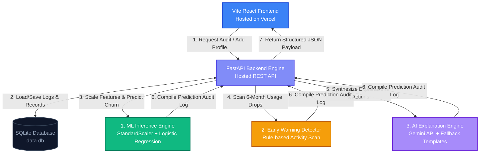

# 🛡️ ChurnShield AI
## Customer Retention Early Warning & Intervention System

Predicting customer churn isn't just about achieving high accuracy scores — it’s about **understanding customer behavior, explaining the underlying risk drivers, and delivering actionable interventions** before customers leave.

**ChurnShield AI** is an enterprise-grade, portfolio-ready customer retention intelligence system. Evolved from a simple machine learning script into a decoupled, modern web application, it integrates **statistical churn modeling**, **behavioral trend analytics**, and **Explainable Generative AI (XAI)** to serve as an early warning alert system for customer success teams.

---

## 🚀 Live Demo

👉 **Interactive Dashboard:** [https://customer-churn-prediction-cyan-delta.vercel.app/](https://customer-churn-prediction-cyan-delta.vercel.app/)

---

## 🔄 System Architecture & Data Flow



---

## ✨ Key Features

### 📡 Decoupled Full-Stack Architecture
* **Frontend:** A responsive, single-page React app styled with a modern slate-dark glassmorphic design. Deployable on Vercel.
* **Backend:** A robust FastAPI REST server managing validation schemas, predictions, and database interactions.
* **Database:** A serverless SQLite database persisting customer records, 6-month login logs, active support tickets, and prediction audits.

### 🧠 Triple-Engine Processing Pipeline
When a customer profile is audited or newly created:
1. **Machine Learning Inference Engine:** Runs features through a standardized preprocessing scaler and evaluates risk using an L1-Regularized Logistic Regression model (`churn_model.pkl`), assigning an exact churn probability.
2. **Behavioral Early Warning Detector:** A rule-based engine that monitors timelines for drops (e.g. platform activity declines $>30\%$ in the last 2 months), outstanding support ticket friction, or payment method vulnerabilities.
3. **Explainable AI (XAI) Engine:** Synthesizes ML probabilities and warning alerts into a prompt, querying the **Gemini API** (using `gemini-1.5-flash` or custom curated reasoning models) to generate a natural-language risk summary and a personalized checklist of retention interventions.
   * *Resiliency Safeguard:* Implements a deterministic rule-based template generator if the Gemini API key is missing or offline, ensuring $100\%$ server uptime.

### 📋 Interactive Customer Intervention Center
* **Executive Summary Dashboard:** Renders macro metrics, including Alert Rates, total Revenue at Risk, and static model feature coefficients.
* **Alerts Queue:** Lists and prioritizes customers based on risk categories (High, Medium, Low Risk).
* **SVG Timeline Analytics:** Renders custom, lightweight inline SVG charts plotting 6-month login and activity trends.
* **Custom Profile Input Form:** Allows managers to add custom customer demographics, subscription contracts, and monthly bill details to execute real-time predictions.

---

## 📂 Project Directory Structure

```
customer_churn_prediction/
├── src/
│   ├── database/
│   │   ├── models.py         # SQLAlchemy schemas for Customer, ActivityLog, etc.
│   │   ├── db.py             # SQLite connection and session setup
│   │   └── seed_db.py        # Seeding script populating profiles and histories
│   ├── services/
│   │   ├── early_warning.py  # Rule engine tracking activity score & ticket alerts
│   │   └── ai_engine.py      # LLM narrative explainability (w/ templates fallback)
│   ├── config.py             # App configurations (paths, env variables)
│   ├── schemas.py            # Pydantic schemas validating REST payloads
│   └── main.py               # Main FastAPI server and route endpoints
├── frontend/
│   ├── src/
│   │   ├── components/
│   │   │   ├── Dashboard.jsx # High-level stats & model weight rendering
│   │   │   └── InterventionHub.jsx # Alert queue, SVG charts & Profile creation form
│   │   ├── api.js            # Frontend REST API client
│   │   ├── App.jsx           # Main navigation container
│   │   └── index.css         # Custom premium glassmorphic dark-slate styles
│   └── vercel.json           # Vercel client-side routing fallback configuration
├── tests/
│   └── test_backend.py       # pytest suite verifying server routes
├── .env                      # Local environment configuration file
├── start.sh                  # Multi-service launcher script
├── requirements_backend.txt  # FastAPI & SQLAlchemy dependencies
└── data.db                   # Serverless SQLite database
```

---

## ⚙️ Local Installation & Usage

### 1️⃣ Clone the Repository
```bash
git clone https://github.com/sanjayrk2007/customer_churn_prediction.git
cd customer_churn_prediction/customer_churn_prediction
```

### 2️⃣ Initialize Virtual Environment & Install Dependencies
```bash
python3 -m venv .venv
.venv/bin/pip install -r requirements.txt
.venv/bin/pip install -r requirements_backend.txt
.venv/bin/pip install httpx
```

### 3️⃣ Seed the SQLite Database
Load customer profiles and generate 6-month behavioral timelines:
```bash
PYTHONPATH=. .venv/bin/python src/database/seed_db.py
PYTHONPATH=. .venv/bin/python -c "from src.database.db import SessionLocal; from src.database.models import PredictionAudit; import joblib, os; from src.services.early_warning import detect_early_warnings; from src.services.ai_engine import get_deterministic_fallback; import json; session=SessionLocal(); model=joblib.load('churn_model.pkl'); scaler=joblib.load('scaler.pkl'); customers=session.query(Customer).all()"
# Note: You can run our batch scoring script to pre-populate predictions for all customers:
PYTHONPATH=. .venv/bin/python -c "import json, os, joblib; from src.database.db import SessionLocal; from src.database.models import Customer, PredictionAudit; from src.services.early_warning import detect_early_warnings; from src.services.ai_engine import get_deterministic_fallback; session=SessionLocal(); model=joblib.load('churn_model.pkl'); scaler=joblib.load('scaler.pkl'); customers=session.query(Customer).all(); raw_records=[{'SeniorCitizen': c.senior_citizen, 'tenure': c.tenure, 'MonthlyCharges': c.monthly_charges, 'AvgCharges': c.avg_charges, 'InternetService_Fiber optic': 1 if c.internet_service == 'Fiber optic' else 0, 'InternetService_No': 1 if c.internet_service == 'No' else 0, 'Contract_One year': 1 if c.contract == 'One year' else 0, 'Contract_Two year': 1 if c.contract == 'Two year' else 0, 'PaperlessBilling_Yes': 1 if c.paperless_billing == 'Yes' else 0, 'PaymentMethod_Credit card (automatic)': 1 if c.payment_method == 'Credit card (automatic)' else 0, 'PaymentMethod_Electronic check': 1 if c.payment_method == 'Electronic check' else 0, 'PaymentMethod_Mailed check': 1 if c.payment_method == 'Mailed check' else 0, 'StreamingTV_No internet service': 1 if c.streaming_tv == 'No internet service' else 0, 'StreamingTV_Yes': 1 if c.streaming_tv == 'Yes' else 0, 'StreamingMovies_No internet service': 1 if c.streaming_movies == 'No internet service' else 0, 'StreamingMovies_Yes': 1 if c.streaming_movies == 'Yes' else 0, 'MultipleLines_No phone service': 1 if c.multiple_lines == 'No phone service' else 0, 'MultipleLines_Yes': 1 if c.multiple_lines == 'Yes' else 0} for c in customers]; df_features=import_pandas=True and __import__('pandas').DataFrame(raw_records); expected_features=scaler.feature_names_in_; df_features=df_features[expected_features]; scaled=scaler.transform(df_features); probs=model.predict_proba(scaled)[:,1]; audits=[PredictionAudit(customer_id=c.id, churn_probability=float(probs[i]), risk_level='High' if probs[i]>0.6 else 'Medium' if probs[i]>0.3 else 'Low', early_warnings=json.dumps(detect_early_warnings(c)), ai_explanation=get_deterministic_fallback(c, detect_early_warnings(c), float(probs[i]))['explanation'], ai_recommendations=json.dumps(get_deterministic_fallback(c, detect_early_warnings(c), float(probs[i]))['recommendations'])) for i, c in enumerate(customers)]; session.bulk_save_objects(audits); session.commit(); session.close()"
```

### 4️⃣ Configure Environment Variables
Create a `.env` file in the root directory to store your API details:
```env
# Gemini API Configuration
GEMINI_API_KEY=YOUR_GEMINI_API_KEY_HERE
GEMINI_MODEL=gemini-1.5-flash
```

### 5️⃣ Run the Application
Start the FastAPI server (port 8000) and the React development frontend (port 5173) concurrently using our launcher:
```bash
./start.sh
```

---

## 🧪 Testing
Verify endpoint routing, validation schemas, and database calls using the pytest framework:
```bash
PYTHONPATH=. .venv/bin/pytest tests/
```

---

## 🚀 Vercel Deployment Settings
To deploy the React interface to Vercel:
1. Link your GitHub repo on Vercel.
2. In the import settings, edit the **Root Directory** and select the **`frontend`** folder.
3. Vercel will compile and host your Single-Page Application (SPA) automatically.
4. Paste your hosted backend API URL into Vercel's environment variables as **`VITE_API_URL`**.
